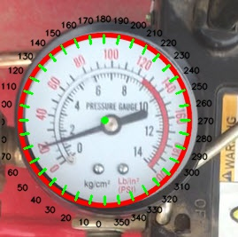
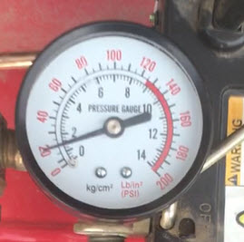

# Analog Gauge Reader

This sample application takes an image or video frame of an analog gauge and reads the value using functions from the OpenCV\* computer vision library.
It consists of two parts: calibration and measurement.  During calibration, the application calibrates an image 
of a gauge (provided by the user) by prompting the user to enter the range of gauge values in degrees.  It then uses these 
calibrated values in the measurement stage to convert the angle of the dial into a meaningful value.

## What you’ll learn
  * Circle detection
  * Line detection

## Gather your materials
  *	Python\* 2.7 or greater
  * OpenCV version 3.3.0 or greater
  *	An image of a gauge (or you can use the sample one provided)

## Setup
1. Take a picture of a gauge or use the gauge-1.jpg provided.  If you name it something other than gauge-1.jpg make sure to
change that in the  `main() ` function.
2. Run the application `python analog_gauge_reader.py` and enter the requested values, using the output file gauge-#-calibration.jpg to determine the values. Here's an example of what the calibration image looks like:  

For the calibration image above, you would enter in the following values:  

3.  The application by default reads the value of the gauge of the image you used for calibration.  For the provided image, it gives a result of 16.4 psi.  Not bad.

Original image:  

Found line: (not normally an output, just to show more of what's going on)  

gauge-2.jpg is provided for the user to try.

## Get the Code
Code is included in this folder of the repository in the .py file.

## How it works
The main functions used from the OpenCV\* library are `HoughCircles` (to detect the outline of the gauge and center point) and `HoughLines` (to detect the dial).

Basic filtering is done as follows:
For cirles (this happens in `calibrate_gauge()`)
* only return circles from HoughCircles that are within reasonable range of the image height (this assumes the gauge takes up most of the view)
* average the resulting circles and use the average for the center point and radius
For lines (this happens in `get_current_value()`)
* apply a threshold using `cv2.threshold.` and `cv2.THRESH_BINARY_INV` with threshold of 175 and maxValue of 255 work fine
* remove all lines outside a given radius
* check if a line is within an acceptable range of the radius
* use the first acceptable line as the dial

There is a considerable amount of trigonometry involved to create the calibration image, mainly sine and cosine to plot the calibration image lines and arctangent to get the angle of the dial.  This approach sets 0/360 to be the -y axis (if the image has a cartesian grid in the middle) and it goes clock-wise. There is a slight modification to make the 0/360 degrees be at the -y axis, by an addition (i+9) in the calculation of p_text[i][j]. Without this +9 the 0/360 point would be on the +x axis.  So this
implementation assumes the gauge is aligned in the image, but it can be adjusted by changing the value of 9 to something else.

IMPORTANT NOTICE: This software is sample software. It is not designed or intended for use in any medical, life-saving or life-sustaining systems, transportation systems, nuclear systems, or for any other mission-critical application in which the failure of the system could lead to critical injury or death. The software may not be fully tested and may contain bugs or errors; it may not be intended or suitable for commercial release. No regulatory approvals for the software have been obtained, and therefore software may not be certified for use in certain countries or environments.
