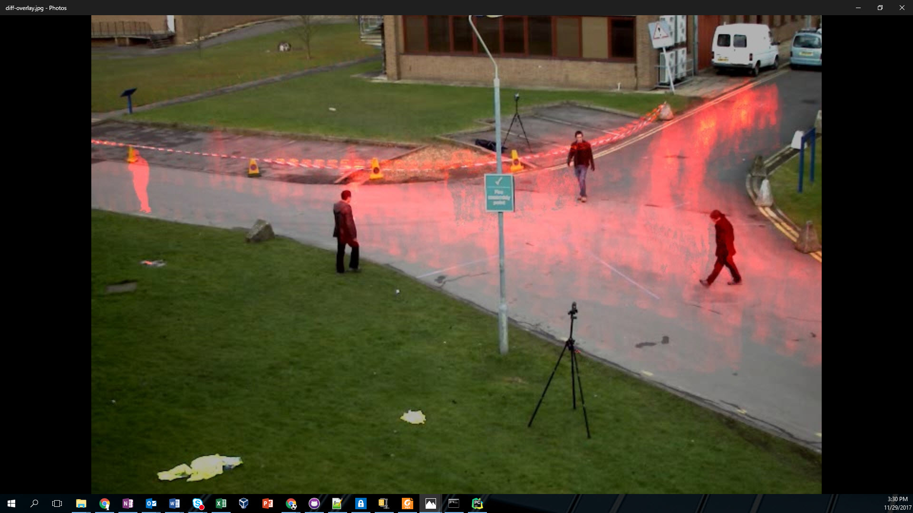

# Motion Heatmap


## What you’ll learn
  * background subtraction
  * application of a threshold
  * accumulation of changed pixels over time
  * add a color/heat map

## Gather your materials
  *	Python 2.7 or greater
  * OpenCV version 3.3.0 or greater
  *	The vtest.avi video from https://github.com/opencv/opencv/blob/master/samples/data/vtest.avi

## Setup
1. You need the extra modules installed for the MOG background subtractor.  This tutorial was tested on Windows, and the easiest way to install it was using
```
pip install opencv-contrib-python
```
1. Download the vtest.avi video from https://github.com/opencv/opencv/blob/master/samples/data/vtest.avi and put it in the same folder as the python script.
2. Run the python script.  You should see a diff-overlay.jpg when it's done.



## Get the Code
Code is included in this folder of the repository in the .py file.

## How it works
The main APIs used in OpenCV are:
MOG background subtractor (cv2.bgsegm.createBackgroundSubtractorMOG()) - https://docs.opencv.org/3.0-beta/modules/video/doc/motion_analysis_and_object_tracking.html?highlight=createbackgroundsubtractormog#createbackgroundsubtractormog
Note: the docs are out of date, and the propoer way to initialize is
```
cv2.bgsegm.createBackgroundSubtractorMOG()
```
cv2.threshold() - https://docs.opencv.org/3.3.1/d7/d4d/tutorial_py_thresholding.html 
cv2.add() - https://docs.opencv.org/3.2.0/d0/d86/tutorial_py_image_arithmetics.html
cv2.applyColorMap() - https://docs.opencv.org/3.0-beta/modules/imgproc/doc/colormaps.html 
cv2.addWeighted() - https://docs.opencv.org/3.2.0/d0/d86/tutorial_py_image_arithmetics.html

The application takes each frame and first applies background subtraction using the cv2.bgsegm.createBackgroundSubtractorMOG() object to create a mask.  A threshold is then applied to the mask to remove small amounts of movement, and also to set the accumulation value for each iteration.  The result of the threshold is added to an accumulation image (one that starts out at all zero and gets added to each iteration without removing anything), which is what records the motion.  At the very end, a color map is applied to the accumulated image so it's easier to see the motion.  This colored imaged is then combined with a copy of the first frame using cv2.addWeighted to accomplish the overlay.

